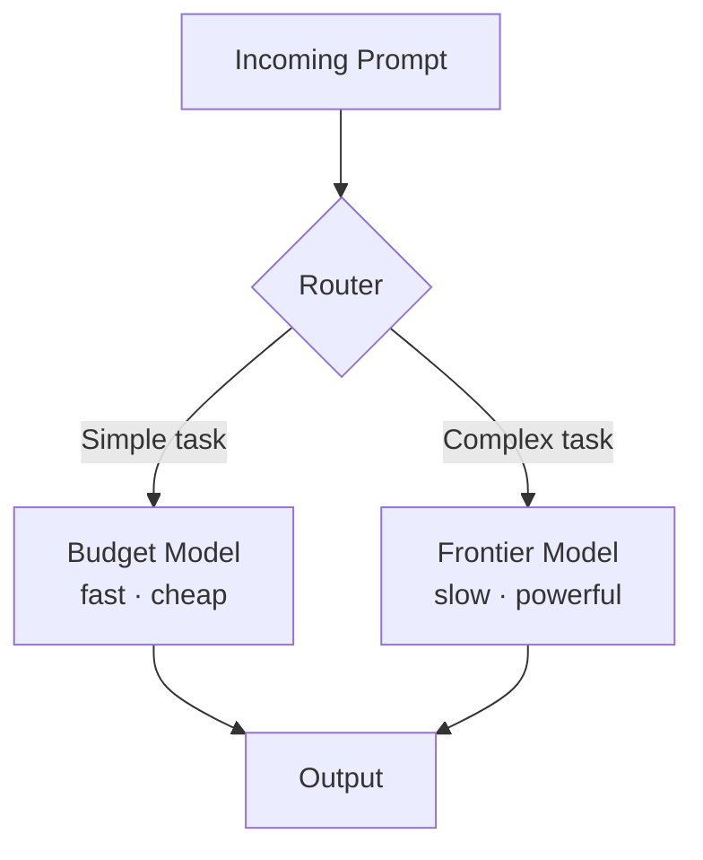

# Model Selection & Benchmark Overview

---
layout: why
---

# Why benchmark hype hurts more than it helps

Developers get flooded with "new best model" announcements every few weeks.

- Every release claims to top the charts — but the charts keep changing
- Many benchmarks are saturated or contaminated with training data
- Chasing #1 distracts from what actually matters: prompting, context, and tool use
- The gap between models is smaller than the gap between good and bad usage

---
layout: little-what
---

# Model selection is less about choosing the right model — and more about instrumenting it the right way.

---
layout: two-cols-header
layoutClass: gap-4
---

# Benchmarks worth following

::left::

**SWE-bench Verified** — resolves real GitHub issues using entire repositories

> [swebench.com](https://swebench.com)

**LiveCodeBench** — contamination-free, continuously updated from LeetCode, AtCoder, CodeForces

> [livecodebench.github.io](https://livecodebench.github.io)

::right::

**BigCodeBench** — complex, function-level tasks requiring diverse external library calls

> [bigcode-bench.github.io](https://bigcode-bench.github.io)

**LM Arena (Chatbot Arena)** — crowdsourced Elo rating via blind human A/B tests

> [lmarena.ai](https://lmarena.ai)

---
layout: two-cols-header
---

# Benchmarks to ignore

::left::

**HumanEval** — saturated

- Frontier models score **93–99%**
- Isolated Python tasks, no real-world context
- Useless for comparing top-tier models today

::right::

**GSM8K** — saturated + contaminated

- Top models score **up to 99%**
- Grade-school math tasks
- Likely present in training data of most models

::bottom::

<Callout type="important">
A benchmark stops being useful the moment all frontier models cluster at the top.
</Callout>

---
layout: two-cols-header
layoutClass: gap-x-lg
---

# Model tiers: cost vs. capability

::left::

**Premium tier**

| Model           | Input            | Output    |
| --------------- | ---------------- | --------- |
| GPT-5.2 Pro     | $21 / 1M         | $168 / 1M |
| GPT-4.5         | $75 / 1M         | $150 / 1M |
| Claude Opus 4.1 | $15 / 1M         | $75 / 1M  |
| o1-preview      | ~$600 total / 1M |           |

::right::

**Budget tier**

| Model             | Input      | Output     |
| ----------------- | ---------- | ---------- |
| Amazon Nova Micro | $0.04 / 1M | $0.14 / 1M |
| GPT-5 nano        | $0.05 / 1M | $0.40 / 1M |
| Gemma 3 27B       | $0.07 / 1M | $0.07 / 1M |
| DeepSeek V3.2     | $0.28 / 1M | $0.42 / 1M |

---
layout: sub-section
---

# Model Routing

Sending the right task to the right model

---
layout: two-cols-header
layoutClass: gap-4
---

# Model routing: air traffic control for AI

::left::

Instead of sending every request to one model, a router **dynamically matches** each prompt to the best model for that task.

- Simple tasks → fast, cheap models (formatting, Q&A)
- Complex tasks → frontier models (deep reasoning, refactoring)
- Potential cost savings of **up to 85%** with near-peak performance

<Callout type="info">
Not all tasks need a $150/1M token model. Most don't.
</Callout>

::right::

---
layout: two-cols-header
layoutClass: gap-4
---

# Two routing strategies

::left::

**Predictive routers**

Analyze prompt complexity _before_ sending the query and predict the best model.

- Examples: RouteLLM, IBM LLM Router
- Uses benchmark-trained algorithms
- Lower latency, but requires training data

::right::

**Nonpredictive routers**

**Cascading** — try the cheapest model first; escalate if the answer is inadequate

**Mass auditions** — query multiple models simultaneously and pick the best output

---
layout: two-cols-header
---

# Where routing happens

::left::

**At the system / agent level** (most common)

- Agentic IDEs route autocomplete to small models, refactoring to frontier models
- Enterprise API layers route by task complexity automatically

::right::

**Inside the model itself**

- **Dynamic reasoning** — GPT-5's real-time router decides when to think deeply vs. respond fast
- **Hybrid thinking mode** — DeepSeek V3.2 switches between chain-of-thought and instant responses
- **Mixture-of-Experts (MoE)** — Llama 4, MiMo-V2-Flash route every token to a specialist subset internally

---
layout: task
---

# Check your tool's model setup
