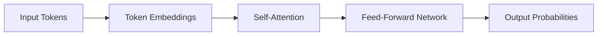
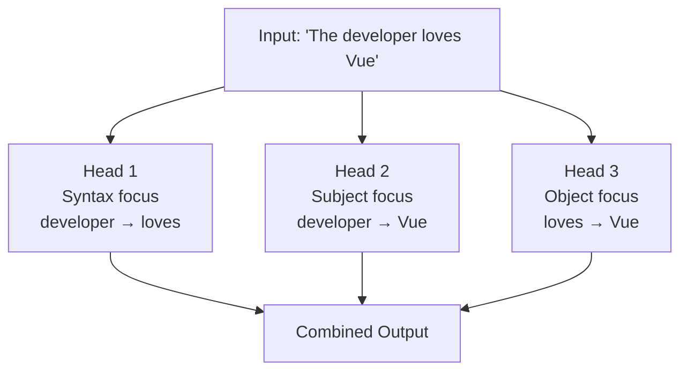

# Tokenization

Text → Tokens → Numbers

---
layout: two-cols-header
layoutClass: gap-4
---

# Text becomes a sequence of numbers

::left::

Every word (or word fragment) is split into **tokens** and mapped to an ID.

| Text     | Tokens            | IDs              |
| -------- | ----------------- | ---------------- |
| `I`      | `I`               | 521              |
| `love`   | `love`            | 2407             |
| `Vue.js` | `Vu` `e` `.` `js` | 119, 83, 13, 542 |

::right::

**Why this matters for developers**

- Token limits ≠ character limits
- Special characters can inflate token count
- Different languages tokenize differently
- Affects how much context fits in one request

<Callout type="info">
1 token ≈ 4 characters. A 4,000-token context holds roughly 3,000 words.
</Callout>

---
layout: sub-section
---

# Embeddings

Meaning as Geometry

---
layout: center
---

# Embedding Visualization: The Basics

<div class="text-xl font-semibold mb-6">Words become points in space</div>

<div class="flex justify-center">
<svg width="500" height="220" viewBox="0 0 500 220">
  <!-- Coordinate system -->
  <line x1="100" y1="180" x2="400" y2="180" class="stroke-gray-500 dark:stroke-gray-400" stroke-width="2"/>
  <line x1="100" y1="40" x2="100" y2="180" class="stroke-gray-500 dark:stroke-gray-400" stroke-width="2"/>

  <!-- Dimension labels -->

<text x="400" y="200" font-size="4" class="fill-gray-600 dark:fill-gray-400">Dimension 1</text>
<text x="60" y="40" font-size="4" class="fill-gray-600 dark:fill-gray-400">Dimension 2</text>

  <!-- Word as a point -->
  <circle cx="250" cy="100" r="6" fill="#6366f1" />
  <text x="260" y="95" font-size="4" font-weight="bold" fill="currentColor">"Vue"</text>

  <!-- Vector representation -->
  <line x1="100" y1="180" x2="250" y2="100" stroke="#6366f1" stroke-width="2" stroke-dasharray="5,5" />

  <!-- Vector coordinates -->
  <rect x="270" y="105" width="120" height="30" rx="4" class="fill-gray-100 dark:fill-gray-800 stroke-gray-300 dark:stroke-gray-600" stroke-width="1"/>
  <text x="280" y="125" font-size="3" font-family="monospace" fill="currentColor">[0.6, 0.4, ...]</text>
</svg>
</div>

<div class="text-center text-base mt-4">
💡 <strong>In reality:</strong> Each word = a point in 768-dimensional space or higher
</div>

---
layout: two-cols-header
layoutClass: gap-4
---

# Words with similar meaning are close in space

::left::

Each token is converted to a **vector** — a point in high-dimensional space.

**Semantically similar tokens cluster together:**

- `developer` ≈ `programmer` ≈ `coder`
- `Vue` ≈ `React` (both frameworks)
- `function` ≈ `method`

**Unrelated tokens are far apart:**

- `database` ≠ `banana`

::right::

**Contextual embeddings**

The same word gets a different vector depending on context:

- `bank` (financial) → near: `money`, `account`
- `bank` (river) → near: `shore`, `water`

<Callout type="info">
This is why LLMs understand that "sort array" and "order list" mean the same thing — their embeddings are close in vector space.
</Callout>

---
layout: two-cols
layoutClass: gap-8
---

# Similar vs Different Words

<div class="mb-4">
Words with similar meanings are close together:
</div>

```typescript
// Similar meaning = similar vectors
const developer = [0.2, 0.8, 0.1, ...]
const programmer = [0.21, 0.79, 0.11, ...]
```

<div class="mt-4 mb-4">
Words with different meanings are far apart:
</div>

```typescript
// Different meaning = different vectors
const database = [0.9, 0.1, 0.3, ...]
const banana = [0.1, 0.2, 0.95, ...]
```

::right::

<div class="flex items-center justify-center h-full">
<svg width="300" height="300" viewBox="0 0 300 300">
  <!-- Coordinate system -->
  <line x1="50" y1="250" x2="250" y2="250" class="stroke-gray-500 dark:stroke-gray-400" stroke-width="2"/>
  <line x1="50" y1="50" x2="50" y2="250" class="stroke-gray-500 dark:stroke-gray-400" stroke-width="2"/>

  <!-- Similar words cluster -->
  <circle cx="140" cy="70" r="5" fill="#6366f1" />
  <text x="148" y="70" font-size="4" fill="currentColor">developer</text>

  <circle cx="150" cy="100" r="5" fill="#6366f1" />
  <text x="158" y="100" font-size="4" fill="currentColor">programmer</text>

  <circle cx="135" cy="85" r="5" fill="#6366f1" />
  <text x="143" y="85" font-size="4" fill="currentColor">coder</text>

  <!-- Different words far apart -->
  <circle cx="80" cy="220" r="5" fill="#ef4444" />
  <text x="88" y="220" font-size="4" fill="currentColor">database</text>

  <circle cx="220" cy="120" r="5" fill="#22c55e" />
  <text x="228" y="120" font-size="4" fill="currentColor">banana</text>
</svg>
</div>

---
layout: center
---

# Context Changes Meaning

<div class="flex justify-center">
<svg width="550" height="300" viewBox="0 0 550 300">
  <!-- Coordinate axes -->
  <line x1="70" y1="240" x2="480" y2="240" class="stroke-gray-500 dark:stroke-gray-400" stroke-width="2"/>
  <line x1="70" y1="60" x2="70" y2="240" class="stroke-gray-500 dark:stroke-gray-400" stroke-width="2"/>

  <!-- First context circle -->
  <circle cx="170" cy="140" r="60" fill="rgba(99, 102, 241, 0.1)" stroke="#6366f1" stroke-width="1"/>
  <text x="170" y="80" font-size="4" text-anchor="middle" class="fill-indigo-600 dark:fill-indigo-400">Financial Context</text>

  <!-- Second context circle -->
  <circle cx="380" cy="180" r="60" fill="rgba(34, 197, 94, 0.1)" stroke="#22c55e" stroke-width="1"/>
  <text x="380" y="120" font-size="4" text-anchor="middle" class="fill-green-600 dark:fill-green-400">Nature Context</text>

  <!-- Bank in first context -->
  <circle cx="170" cy="140" r="6" fill="#6366f1" />
  <text x="150" y="140" font-size="4" font-weight="bold" text-anchor="end" fill="currentColor">bank</text>

  <!-- Bank in second context -->
  <circle cx="380" cy="180" r="6" fill="#22c55e" />
  <text x="400" y="180" font-size="4" font-weight="bold" fill="currentColor">bank</text>

  <!-- Related words in contexts -->
  <circle cx="150" cy="120" r="4" fill="#6366f1" opacity="0.7" />
  <text x="140" y="120" font-size="3" text-anchor="end" fill="currentColor">money</text>

  <circle cx="190" cy="160" r="4" fill="#6366f1" opacity="0.7" />
  <text x="200" y="160" font-size="3" fill="currentColor">account</text>

  <circle cx="360" cy="160" r="4" fill="#22c55e" opacity="0.7" />
  <text x="350" y="160" font-size="3" text-anchor="end" fill="currentColor">river</text>

  <circle cx="400" cy="200" r="4" fill="#22c55e" opacity="0.7" />
  <text x="410" y="200" font-size="3" fill="currentColor">shore</text>
</svg>
</div>

<Callout type="info">

**Key insight:** The same word has different vectors depending on context

</Callout>

---
layout: sub-section
---

# Transformer Architecture

The Engine Behind Modern LLMs

---
layout: center
---

# Transformer Architecture

<div class="text-xl font-semibold mb-6">The "brain" of modern LLMs</div>

<div class="flex justify-center">
<svg width="550" height="280" viewBox="0 0 550 280" class="[&_marker_path]:fill-gray-500 dark:[&_marker_path]:fill-gray-400">
  <!-- Main transformer architecture outline -->
  <rect x="100" y="40" width="350" height="220" rx="10" fill="rgba(99, 102, 241, 0.1)" stroke="#6366f1" stroke-width="2"/>
  <text x="275" y="30" font-size="6" text-anchor="middle" font-weight="bold" class="fill-indigo-600 dark:fill-indigo-400">Transformer</text>

  <!-- Input and output areas -->
  <rect x="150" y="60" width="250" height="30" rx="5" class="fill-gray-100 dark:fill-gray-800 stroke-gray-300 dark:stroke-gray-600" stroke-width="1"/>
  <text x="275" y="80" font-size="5" text-anchor="middle" fill="currentColor">Input Tokens</text>

  <!-- Architecture components -->
  <rect x="150" y="110" width="250" height="40" rx="5" fill="rgba(59, 130, 246, 0.2)" stroke="#3b82f6" stroke-width="1"/>
  <text x="275" y="135" font-size="5" text-anchor="middle" class="fill-blue-600 dark:fill-blue-400">Self-Attention Mechanisms</text>

  <rect x="150" y="160" width="250" height="40" rx="5" fill="rgba(16, 185, 129, 0.2)" stroke="#10b981" stroke-width="1"/>
  <text x="275" y="185" font-size="5" text-anchor="middle" class="fill-emerald-600 dark:fill-emerald-400">Feed-Forward Networks</text>

  <rect x="150" y="210" width="250" height="40" rx="5" class="fill-gray-100 dark:fill-gray-800 stroke-gray-300 dark:stroke-gray-600" stroke-width="1"/>
  <text x="275" y="235" font-size="5" text-anchor="middle" fill="currentColor">Output Probabilities</text>

  <!-- Flow arrows -->
  <line x1="275" y1="90" x2="275" y2="110" class="stroke-gray-500 dark:stroke-gray-400" stroke-width="1" marker-end="url(#arrow)"/>
  <line x1="275" y1="150" x2="275" y2="160" class="stroke-gray-500 dark:stroke-gray-400" stroke-width="1" marker-end="url(#arrow)"/>
  <line x1="275" y1="200" x2="275" y2="210" class="stroke-gray-500 dark:stroke-gray-400" stroke-width="1" marker-end="url(#arrow)"/>

  <!-- Arrow marker definition -->
  <defs>
    <marker id="arrow" markerWidth="10" markerHeight="10" refX="9" refY="3" orient="auto" markerUnits="strokeWidth">
      <path d="M0,0 L0,6 L9,3 z" fill="#888" />
    </marker>
  </defs>
</svg>
</div>

<Callout type="info">

**Key insight:** Transformers use attention to understand relationships between words.

</Callout>

---
layout: default
---

# How the Transformer processes input



**Each layer stacks on the previous — models have dozens of these layers.**

- **Self-Attention** — each token looks at every other token to decide relevance
- **Feed-Forward Network** — processes each token independently after attention
- **Output Probabilities** — a distribution over the entire vocabulary for the next token

---
layout: two-cols-header
layoutClass: gap-4
---

# Self-Attention: Q, K, V

::left::

Every token generates three vectors:

| Vector    | Question it answers            |
| --------- | ------------------------------ |
| **Query** | What am I looking for?         |
| **Key**   | What do I offer to others?     |
| **Value** | What information do I provide? |

Attention score = how well a Query matches a Key.

The result: a weighted mix of Values — what the token "knows" after reading context.

::right::

**Example:** `"The developer who loves Vue writes clean code."`

When processing `Vue`:

- 60% attention → `loves` (relationship)
- 30% attention → `developer` (subject)
- 10% attention → `writes` (outcome)

<Callout type="info">
Unlike older models (RNNs), Transformers process all tokens in parallel and can connect distant tokens directly.
</Callout>

---
layout: default
---

# Multi-Head Attention

Instead of one attention pass, the model runs **multiple heads in parallel** — each focuses on a different relationship pattern.



Each head learns a different type of token relationship. Combined, they give the model rich, multi-perspective understanding.

---
layout: sub-section
---

# Next-Token Prediction

How the model generates text

---
layout: two-cols-header
layoutClass: gap-4
---

# Each token is a weighted probability roll

::left::

**Prompt:** `const greeting =`

| Next token      | Probability |
| --------------- | ----------- |
| `"Hello"`       | 52%         |
| `'Hi'`          | 22%         |
| `` `Welcome` `` | 15%         |
| `getUserName()` | 11%         |

The model picks one, appends it, then predicts again — token by token.

::right::

**Temperature controls creativity**

<WindowMockup codeblock title="config">

```typescript
// Low temperature (0.0–0.3)
// → deterministic, focused
// Best for: code generation

// Medium temperature (0.5–0.8)
// → balanced variety
// Best for: explanations

// High temperature (1.0+)
// → creative, unpredictable
// Best for: brainstorming
```

</WindowMockup>

---
layout: default
---

# Why it feels intelligent

- Grammar and coherence **emerge statistically** from billions of training examples
- The model captures **patterns**, not truth — there is no fact-checking built in
- It **simulates** reasoning without having understanding
- Billions of learned weights create the illusion of knowledge

<Callout type="important">
LLMs are extremely good pattern matchers — not reasoners. This distinction explains every failure mode you will encounter.
</Callout>

---
layout: default
---

# Explore it yourself

**Interactive Transformer Explainer** — visualizes tokenization, embeddings, and attention live:

> https://poloclub.github.io/transformer-explainer/

**OpenAI Tokenizer** — see exactly how your text is split into tokens:

> https://platform.openai.com/tokenizer
