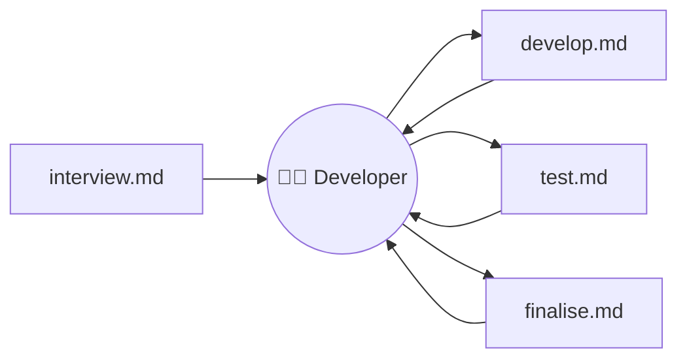
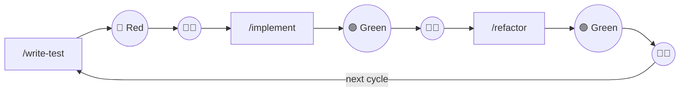

# Rules & Instructions

## Fine grained task delegation

---
layout: why
---

# Why this topic matters

Developers face the challenge of working with AI while ensuring quality; rules with the right structure make delegation easier and more effective.

- Each developer faces the challenge to work with AI, but the quality needs to be ensured
- Developers must understand how to delegate tasks they normally do manually
- Rules are very easy and with the correct structure they can help a lot

---
layout: little-what
---

# What is it?

An instruction provides reusable and precise context to a model to improve the quality of the LLM's output.

---
layout: sub-section
---

# Vendor-specific files

---
layout: two-cols-header
layoutClass: gap-x-2
---

# Vendor-specific files

::left::

- **.cursorrules**, **claude.md**, Copilot instructions — same concept, differ in detail
- Messy to maintain if a team uses different setups
- Manageable especially with AI support

::right::

<WindowMockup codeblock title=".cursor/rules/ts-style.mdc" padding="2rem">

```md
---
description: Use TypeScript strict mode
globs: ['**/*.ts', '**/*.tsx']
---

Prefer explicit types over inference for public APIs.
Use functional patterns where possible.
```

</WindowMockup>

---
layout: sub-section
---

# AGENTS.md

---
layout: two-cols-header
layoutClass: gap-4
---

# Emerging standard: AGENTS.md

::left::

- Open format: [agents.md](https://agents.md/) — many vendors support it
- Typical sections: project overview, build and test commands, code style guidelines, testing instructions, security considerations

::right::

<WindowMockup codeblock title="AGENTS.md" padding="1rem">

```md
# AGENTS.md

## Setup commands

- Start dev: `pnpm dev`
- Run tests: `pnpm test`

## Code style

- TypeScript strict mode
- Single quotes, no semicolons
```

</WindowMockup>

::bottom::
<Callout type="warning">
Claude: no native support yet; <code>CLAUDE.md</code> can reference <code>AGENTS.md</code> to make it work.
</Callout>

---
layout: default
---

# AGENTS.md — what to put in

- **Project overview** — what the repo does, main entry points
- **Build and test commands** — how to install, run, test
- **Code style guidelines** — formatting, naming, patterns
- **Testing instructions** — how to run and extend tests
- **Security considerations** — secrets, permissions, deployment

---
layout: two-cols-header
layoutClass: gap-4
---

# Nested AGENTS.md

::left::

- Multiple AGENTS.md files can live in one project
- The agent reads the **nearest** file in the directory tree (closest takes precedence)
- Example: OpenAI repo has 88 AGENTS.md files; each subproject can ship tailored instructions

::right::

<WindowMockup codeblock title="project/" padding="1rem">

```text
project/
├── AGENTS.md           # Root: global context
├── shipment/
│   └── AGENTS.md       # Domain: shipment
├── payment/
│   └── AGENTS.md       # Domain: payment
└── inventory/
    └── AGENTS.md       # Domain: inventory
```

</WindowMockup>

::bottom::
<Callout type="info">
Nearest AGENTS.md to the edited file wins — each domain gets tailored instructions.
</Callout>

---
layout: sub-section
---

# Scope of rules

---
layout: default
---

# Where rules apply

- **Global** — loaded for the whole workspace (e.g. .cursor/rules)
- **Per chat** — mention a rule file by name (e.g. @filename) in the conversation
- **Commands** — many vendors support **Commands** (e.g. `/create-pr`, `/interview`, `/commit`): one instruction per concrete task
- Goal: fine-grained control and custom workflows

---
layout: default
---

# Evolution: from “god rule” to task-oriented

- **Before:** One big file with everything — coding guidelines, architecture, conventions
- **Now:** Think in **tasks** and steps; improve the development process with focused rules
- Use Commands for: **interview → develop → test → finalise** — each step has its own instruction and puts the developer in the loop to review and tune the prompt

---
layout: default
---

# Workflow - Dev-In-The-Loop



<Callout type="tip" v-click>
Delegate repeating tasks. You are the expert. The agent offers opportunities. Some of them might be a surprise.
</Callout>

<!--
| Step      | Purpose                           |
| --------- | --------------------------------- |
| Interview | Gather requirements, clarify      |
| Develop   | Implement with clear instructions |
| Test      | Run checks, fix failures          |
| Finalise  | Commit, PR, review                |

Each rule file or command supports one step and keeps the developer in the loop.
-->

---
layout: sub-section
---

# ⚠️ Beware generated rules!

## You need to own the rules.

---
layout: two-cols-header
layoutClass: gap-2
---

# Two sides of the same coin

::left::

**Generated rules** — productivity impact

<div v-click>

1. **~28% longer** runtime (vs. repos with hand-crafted instructions)
2. **~17% more** output tokens (less focused, higher cost)
3. **REASON**: Replicate existing content and amplify it; **no vision**, no sense of what is already misused

</div>

::right::

**Your own rules** (e.g. AGENTS.md)

<div v-click>

- Research: agents **~28% faster**, **~17% fewer** output tokens
- Make rules your own; describe the **best version** of your project
- **Put yourself in the loop**

</div>

::bottom::

Sources: [arXiv:2601.20404](https://arxiv.org/abs/2601.20404) · [elmd\_](https://x.com/elmd_/status/2025976479276806294)

---
layout: default
---

# Tip

- Make rules **your own**
- Instruct agents to be **very critical** about the provided content
- Describe the **best version** of your project instead of taking existing things for granted
- **Put yourself in the loop**

<br><br>

<Callout type="important" v-click>
Rules are typically loaded once when the agent is initialized. If you edit a rule file, prompt the agent to read that file again (e.g. by @-mentioning it).
</Callout>

---
layout: task
---

# Create Refactoring-Instructions

---
layout: sub-section
---

# Skills

---
layout: why
---

# Why Skills?

Skills are the next step beyond rules and commands — they package reusable prompts together with examples, scripts and assets so you can automate entire work routines.

- Rules give guidance · commands trigger one task — but real workflows need **more**: examples, scripts, structured assets
- Skills are the **latest standard** — a must-know for any team working with AI agents
- Once written, a Skill is reused automatically: no more copy-pasting instructions across conversations

---
layout: little-what
---

# What is a Skill?

A Skill automates everyday tasks by combining a structured prompt (`SKILL.md`) with scripts, references and assets — and you can chain Skills together to automate entire work routines.

---
layout: default
---

# Shape of `SKILL.md`

<WindowMockup codeblock title=".cursor/skills/github-issue/SKILL.md" padding="1rem">

```md{*|1,5|2-4|7|9-11|13-17|*}
---
name: github-issue
description: Analyse a GitHub Issue and draft a response.
  Use when the user mentions issues, bugs, or feature requests.
---

# GitHub Issue Skill

## When to Use

- User provides a GitHub issue URL or mentions an issue

## Instructions

1. Fetch the issue using scripts/fetch-issue.sh
2. Summarise the problem and suggest labels
3. Draft a comment using assets/issue-template.md
```

</WindowMockup>

---
layout: two-cols-header
layoutClass: gap-4
---

# Skill file structure

::left::

- **`SKILL.md`** — required; frontmatter + instructions
- **`scripts/`** — executable code (bash, python …) run by the agent
- **`references/`** — extra docs loaded on demand, zero cost until read
- **`assets/`** — templates, images, config files

<Callout type="info" class="mt-4">
<code>.cursor/skills/</code> project-level &nbsp;·&nbsp; <code>~/.cursor/skills/</code> user-level (global)
</Callout>

::right::

<WindowMockup codeblock title=".cursor/skills/" padding="1rem">

```text
.cursor/skills/
└── github-issue/
    ├── SKILL.md
    ├── scripts/
    │   └── fetch-issue.sh
    ├── references/
    │   └── REFERENCE.md
    └── assets/
        └── issue-template.md
```

</WindowMockup>

---
layout: default
---

# Progressive loading — three levels

- **Level 1 — Metadata** _(always, ~100 tokens)_: `name` + `description` from frontmatter — every installed Skill, zero context penalty
- **Level 2 — Instructions** _(when triggered, < 5 k tokens)_: full `SKILL.md` body loaded into context
- **Level 3 — Resources** _(as needed, unlimited)_: scripts, references, assets — read only when referenced

<br><br>

<Callout type="tip" v-click>
Many Skills installed = no context penalty. Scripts run via bash — their <strong>code never enters the context window</strong>, only their output does.
</Callout>

---
layout: two-cols-header
layoutClass: gap-4
---

# Before / After Skills

::left::

## Before

- Copy-paste instructions into every conversation
- Rewrite context and examples each time
- Forget edge cases, lose examples
- No structure — hard to share with the team

::right::

## After

- Call `/github-issue` — instructions, scripts and assets auto-loaded
- Consistent results every time
- Skills live in the repo — versioned, reviewable, shareable
- Chain Skills to automate full routines

---
layout: default
---

# Red-Green-Refactor — built with Skills

<br>



<br><br>

<Callout type="tip" v-click>
Each Skill owns one step. The developer stays in the loop at every transition.
</Callout>

---
layout: task
---

# Task: Migrate to a Skill

---
layout: task
---

# Task: Requirements-Engineering Skill
