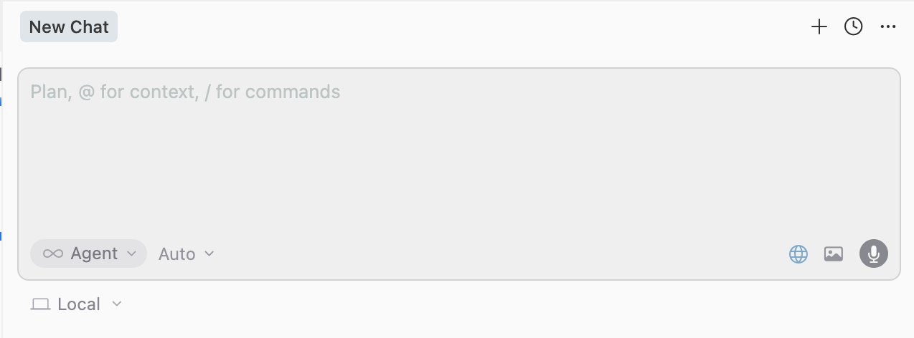
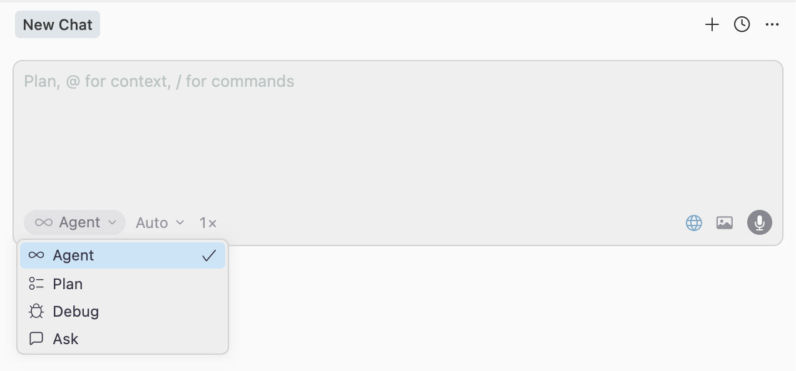
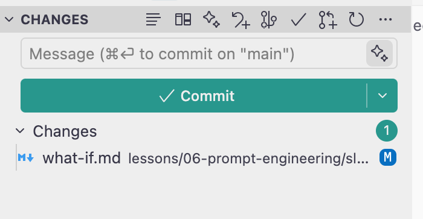
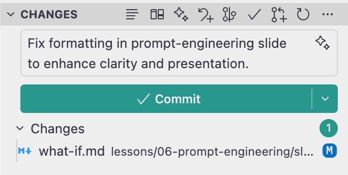
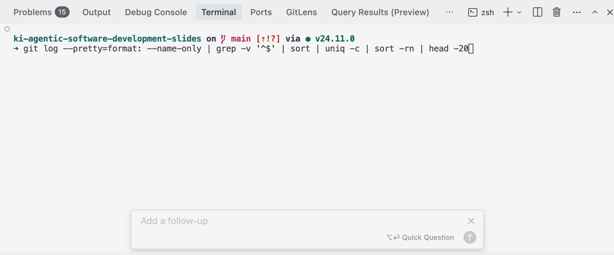
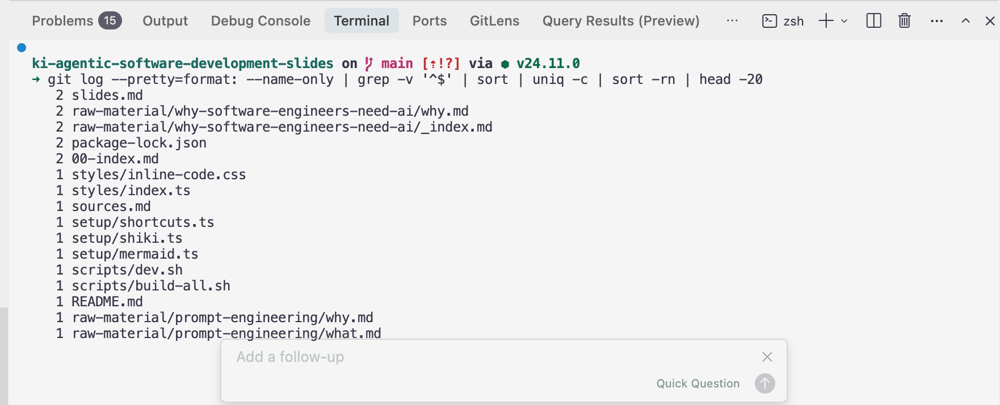

# Code Agents: Feature Overview

---
layout: why
---

# Why It Matters

Most developers only scratch the surface — knowing the full toolkit unlocks a completely different level of productivity.

- Most devs only use chat — but that's just the beginning
- Hidden features unlock a new level of speed and focus
- Knowing the tools means knowing when to use them

---
layout: little-what
---

# What Is a Code Agent?

Switching to a Code Agent is like trading your bicycle for a sports car — same road, completely different ride.

---
layout: two-cols-header
layoutClass: gap-4
---

# Agent Mode: Full Autonomy

::left::

The agent reads, writes, runs tools, and iterates until the task is done — hands-free.

- Picks the right tools automatically
- Iterates: runs, fails, fixes, repeats
- Best for: multi-step, cross-file tasks

::right::

  
  

---
layout: image-right
image: /lessons/08-code-agents/slides/code-agents/assets/ask-mode.png
backgroundSize: 100%
---

# Ask Mode: Safe Exploration

Read-only. The agent can look but not touch.

- Explore and understand code without risk
- Perfect for code reviews and Q&A
- No files are created or modified
- Best for: learning, reviewing, clarifying

---
layout: image-right
image: /lessons/08-code-agents/slides/code-agents/assets/debug-mode.png
backgroundSize: 100%
---

# Debug Mode: Systematic Investigation

Designed for bugs. Collects runtime evidence, traces root causes.

- Structured, methodical investigation
- Gathers evidence before suggesting fixes
- Best for: tricky bugs, unexpected behavior

---
layout: image-right
image: /lessons/08-code-agents/slides/code-agents/assets//plan-mode.png
backgroundSize: 100%
---

# Plan Mode: Think Before You Code

Read-only planning phase — design the approach, then commit.

- No code changes until you approve the plan
- Surfaces trade-offs and architectural decisions
- Prevents expensive mistakes
- Best for: large refactors, new features

---
layout: two-cols-header
layoutClass: gap-x-sm
---

# AI Commit Messages

::left::

- One click. A conventional commit message, generated from your diff.
- Describes **what changed** and **why**
- Follows Conventional Commits format
- Consistent across the whole team
- Zero copy-paste from diff to message

::right::

  
  

---
layout: two-cols-header
layoutClass: gap-4
---

# Terminal: Generate Commands

::left::

- Prompt for generating valid cli commands
- e.g. git command, angular-cli or any shell-Command.
- Stop looking up commands
- No context switch to the chat

::right::

  
  

---
layout: image-right
backgroundSize: 100%
image: /lessons/08-code-agents/slides/code-agents/assets/browser-integration.png
---

# Browser Integration

The agent navigates, clicks, and inspects — a full browser under AI control.

- **① Selector** — pick elements from the live DOM
- **② DOM access** — inspect and interact with elements
- **③ Browser Console** — read logs and errors inline
- Best for: frontend testing, debugging visual issues

---
layout: what-if
---

# What if you combine Agent mode with MCP tools and custom rules?

The more context and tools the agent has, the further the automation can reach — from writing code to deploying it.
