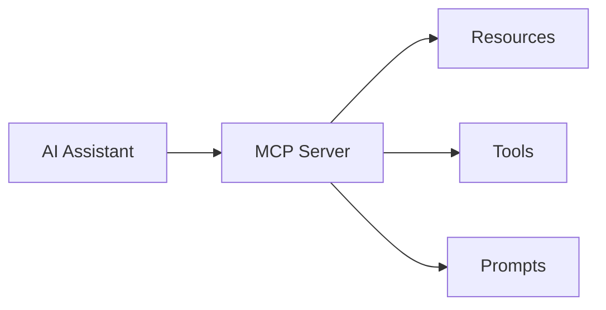
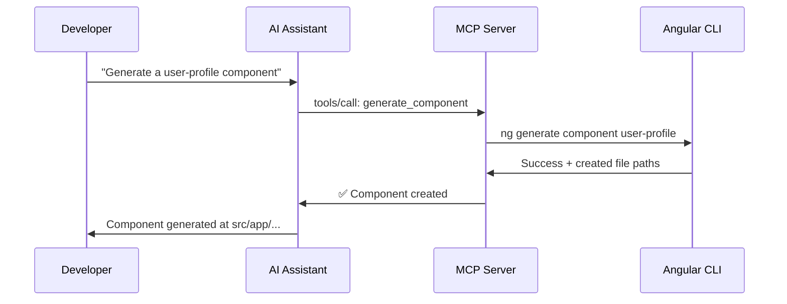

# Model Context Protocol

---
layout: why
---

# Why MCP Matters

AI is a brilliant colleague who can't touch your keyboard — it can suggest, but you have to do everything yourself.

- No direct access to your project files or structure
- Can't run commands, see error logs, or verify its own output
- Manual copy-paste of every suggestion costs 5–10 minutes per task
- Each AI tool has its own fragmented integration story

---
layout: little-what
---

# What Is MCP?

MCP (Model Context Protocol) is an open standard that lets AI assistants securely connect to external tools, files, and services — turning AI from advisor into active collaborator.

---
layout: two-cols-header
layoutClass: gap-4
---

# MCP Architecture: Three Building Blocks

::left::

**Resources** _(like GET endpoints)_

- Provide read-only data to the AI
- Project files, configs, documentation

**Tools** _(like POST endpoints)_

- Enable the AI to perform actions
- Run commands, write files, call APIs

**Prompts** _(reusable templates)_

- Pre-defined workflows for common tasks
- Context-aware interaction patterns

::right::



---
layout: default
---

# Agents Use MCP Tools Out of the Box

Most AI coding agents ship with built-in tools — no configuration needed.

- **File access** — read and write files in your project
- **Bash / Shell** — execute any terminal command
- **Browser** — navigate pages, interact with UI elements, read the DOM

```text
Browse http://site.org and summarise its contents
```

<Callout type="info">
Built-in tools give the agent its baseline capabilities. MCP servers extend them with your own integrations.
</Callout>

---
layout: two-cols-header
layoutClass: gap-4
---

# Local vs Remote MCP Servers

::left::

### Local (STDIO)

- Runs as a process on your machine
- Communicates via standard input/output
- Most common for development tooling
- Zero network overhead

```json
{
  "mcpServers": {
    "my-server": {
      "command": "node",
      "args": ["dist/index.js"]
    }
  }
}
```

::right::

### Remote (Streamable HTTP)

- Runs on a server, accessed over HTTP
- Enables shared team tools
- Suitable for cloud-based workflows
- Requires authentication setup

```json
{
  "mcpServers": {
    "my-server": {
      "url": "https://my-mcp.example.com/mcp"
    }
  }
}
```

---
layout: default
---

# MCP Ecosystem

MCP is an open standard — anyone can publish or consume servers, creating a growing ecosystem of reusable integrations.

**Official servers:** Filesystem, Git, Database, Web Search

**Community servers:** Docker, AWS, Slack, Playwright, and hundreds more → [mcp.so](https://mcp.so)

**Your own server:** Wrap any internal tool, CLI, or API as an MCP server

<Callout type="info">
The standard is backed by Anthropic but is AI-assistant-agnostic — it works with Cursor, Claude Desktop, GitHub Copilot, and others.
</Callout>

---
layout: default
---

# MCP Communication Flow



---
layout: two-cols-header
layoutClass: gap-4
---

# MCP Server vs MCP Client

::left::

### MCP Server

Exposes tools, resources, and prompts to the AI

- Executes commands and manages permissions
- Runs as a local process or remote service
- **You build this** for your custom integrations

::right::

### MCP Client

The AI assistant that connects to your server

- Cursor, Claude Desktop, GitHub Copilot
- Discovers available tools automatically
- Decides when and how to call them

<Callout type="info">
You only need to build the server side. The client is already your AI assistant.
</Callout>

---
layout: sub-section
---

# Building an MCP Server

---
layout: default
---

# Project Setup

```bash
npm install @modelcontextprotocol/sdk zod
npm install --save-dev @types/node
```

```
tools/
└── angular-mcp/
    ├── index.ts
    └── tsconfig.json
```

```json
{
  "compilerOptions": {
    "target": "ES2022",
    "module": "NodeNext",
    "moduleResolution": "NodeNext",
    "outDir": "../../dist/angular-mcp"
  }
}
```

<Callout type="info">
The <strong>@modelcontextprotocol/sdk</strong> handles all protocol complexity — you focus on your tool logic.
</Callout>

---
layout: default
---

# Create and Initialize the Server

```ts {all}{lines:true}
import { McpServer } from '@modelcontextprotocol/sdk/server/mcp.js';
import { StdioServerTransport } from '@modelcontextprotocol/sdk/server/stdio.js';
import { exec as execCallback } from 'child_process';
import { promisify } from 'util';
import { z } from 'zod';

const exec = promisify(execCallback);

const server = new McpServer({
  name: 'angular-mcp',
  version: '1.0.0',
});

const transport = new StdioServerTransport();
await server.connect(transport);
```

---
layout: two-cols-header
layoutClass: gap-4
---

# Register a Tool

::left::

- `inputSchema` uses Zod — validates parameters before execution
- The `description` tells the AI when to use this tool
- Return structured text so the AI gets clear feedback

::right::

```ts {all}{lines:true}
server.registerTool(
  'generate_component',
  {
    title: 'Generate Angular Component',
    description: 'Creates a new Angular component using the Angular CLI',
    inputSchema: {
      name: z.string().describe('Component name'),
      path: z.string().optional().describe('Target path in the project'),
    },
  },
  async ({ name, path }) => {
    // Tool implementation
  }
);
```

---
layout: default
---

# Implement the Tool Logic

```ts {all}{lines:true}
async ({ name, path }) => {
  const target = path ? `${path.replace(/^src\/app\/?/, '')}/${name}` : name;

  const cmd = `npx @angular/cli generate component ${target} \
    --standalone --flat --skip-tests --inline-style --inline-template`;

  try {
    const { stdout } = await exec(cmd, { cwd: projectRoot });
    return { content: [{ type: 'text', text: `✅ Generated:\n${stdout}` }] };
  } catch (e) {
    const msg = e instanceof Error ? e.message : String(e);
    return { content: [{ type: 'text', text: `❌ Error: ${msg}` }] };
  }
};
```

---
layout: default
---

# Connect to Cursor

Create or edit `~/.cursor/mcp.json`:

```json {all}{lines:true}
{
  "mcpServers": {
    "angular-mcp": {
      "command": "node",
      "args": ["/absolute/path/to/dist/angular-mcp/index.js"],
      "cwd": "/absolute/path/to/your/project"
    }
  }
}
```

Then reload Cursor: **Cmd+Shift+P → Developer: Reload Window**

<Callout type="warning">
Use absolute paths. Relative paths will not resolve correctly from Cursor's process.
</Callout>

---
layout: what-if
---

# What if we extend the MCP server beyond component generation?

Angular migrations, test runs, linting — any CLI command can become a tool the AI calls autonomously.

---
layout: two-cols-header
layoutClass: gap-4
---

# Extending Your MCP Server

::left::

### More Tool Ideas

```ts
server.registerTool(
  'run_migration',
  {
    description: 'Run Angular version migration',
    inputSchema: {
      version: z.string().describe('Target Angular version'),
    },
  },
  async ({ version }) => {
    const cmd = `npx @angular/cli update @angular/core@${version}`;
    // ...
  }
);
```

::right::

### Security Checklist

- Validate inputs — reject path traversal (`../`)
- Sanitize component and file names
- Limit scope — only expose necessary commands
- Apply principle of least privilege

<Callout type="warning">
If the AI can call a tool, assume it will. Design tool boundaries deliberately.
</Callout>

---
layout: task
---

# Build an Angular Migration MCP Tool
